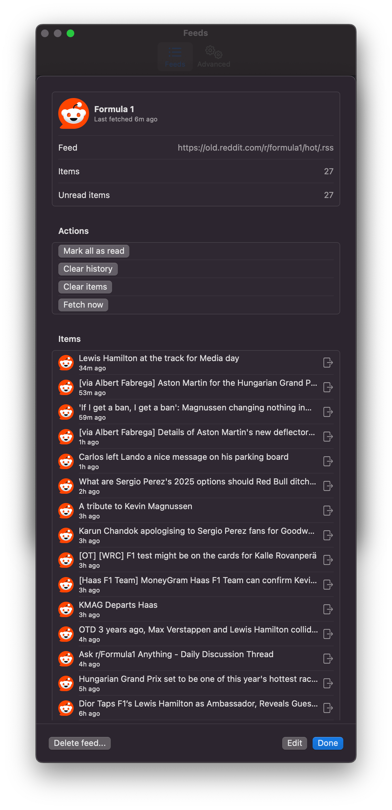

<p align="center">
  
</p>
<p align="center">
  <a href="https://github.com/swiftlang/swift/releases/tag/swift-6.0-RELEASE"></a>
  <a href="https://github.com/AlexGustafsson/RSSBar/releases"></a>
  <a href="https://github.com/AlexGustafsson/RSSBar/blob/main/Package.swift"></a>
  <br>
  <strong><a href="#quickstart">Quick Start</a> | <a href="#contribute">Contribute</a> </strong>
</p>

# RSSBar

### An application for RSS, Atom and JSON feeds in the macOS menu bar

## Features

- Native UI
- Fast and efficient
- Supports RSS, Atom and JSON Feed
- Supports alternate links (finds feeds from a regular web page)
- Supports Intel and Apple silicon
- Supports macOS 15 (Sequoia) and later
- Import and export of feeds

## Quickstart

TBD

## Screenshots

## Overview


## Other

| Light mode                                                                                | Dark mode                                                                               |
| ----------------------------------------------------------------------------------------- | --------------------------------------------------------------------------------------- |
|                   |                   |
|         |         |
|                  |                  |
|  |  |
|            |            |

## Contribute

### Building

```shell
# Build and run the app
make run

# Run tests
make test

# Buld the app
make build

# Lint and format code
make lint
make format

# Build the app bundle
make app

# Buld the installer (requires node and npm)
make installer
```

### Signing

1. Create a self-signed certificate using the Keychain > Certificate Assistant.
2. Either use the basic / quick wizard and select the code signing type, or use
   the advacned wizard and enable (at least) signatures and the code signing
   extended usage.
3. Mark the certificate as trusted for code signing.
4. Build the installer with `CODESIGN_IDENTITY` set to the name of your
   identity.

### SwiftUI

1. Extract To Separate Struct: Use when you want something, custom and reusable.
2. Extract To Local Computed Property: Use when you want something private and internal.
3. Extract To A Function: Also works for something private and internal, but personally I would prefer a computed property for that use case.
4. Extract To an @ViewBuilder Function: Great for when you want to enable another View to pass you a View.
5. Extract To an @ViewBuilder Computed Property: Great for when you need something internal and private, that also has some internal logic, especially if you need to erase Type.
6. Extract To static func or var: Great for when you want mock example Views.
7. Extract To A Style: Great for when you only want to extract custom styling but not custom logic.

### SwiftData gotchas

- Sometimes, you have to populate relationships before saving them, sometimes
  not. Not doing so can make SwiftData crash.
- Sorting an array of a SwiftData model does not always sort the array - not
  even in the local scope. Always store a temporary array first, sort it, and
  then assign it to the model.
- Sometimes, if you look at SwiftData in the wrong way, it will look back and
  crash. The crashes never come with helpful errors. You'll have to use a
  debugger and try to correlate them (segfaults and what not), or comment out
  code until you find the culprit.
- This one is well documented, but always create a new `ModelContext` for every
  thread. This includes completion handlers.

### Resources

- <https://book.hacktricks.xyz/macos-hardening/macos-security-and-privilege-escalation/macos-security-protections/macos-sandbox>
- <https://developer.apple.com/documentation/bundleresources/placing_content_in_a_bundle>

## Similar software

In the past I've used both RSSBot and baRSS. Both of which work great. I decided
to write RSSBar for a few different reasons:

- Native support for Apple silicon. RSSBot, for example, requires Rosetta
- Support additional feed formats, without any third-party dependencies. RSSBot
  and baRSS, for example both only support RSS. baRSS uses RSXML.
- Include an expressive, native UI that feels at home in macOS Sonoma and later

Regarding the last point; the UI is made to look similar to the Wi-Fi menu bar
application as well as Safari's password settings.

Note that RSSBar is not nor ever will be an "RSS reader". There are some great
ones out there, though:

- <https://netnewswire.com>
- <https://www.vienna-rss.com>
